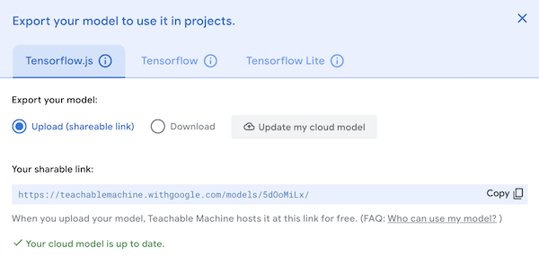
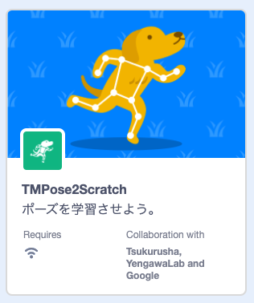
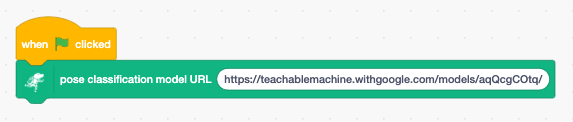
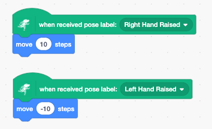

## サポートのお願い

TMPose2Scratchは2020年よりオープンソースかつ無料で提供しており、学校や各種プログラミング教室はじめさまざまな場所で利用されております。継続して開発を続けるためには、使っていただいている皆さまからの支援が必要です。<br />
[一杯のコーヒー](https://www.buymeacoffee.com/champierre)という形でサポートをいただけると大変ありがたく思います。

<a href="https://www.buymeacoffee.com/champierre"></a>

# TMPose2Scratch

TMPose2Scratch connects Google Teachable Machine 2 with Scratch 3. You can use **pose recognition** on Scratch project.

## License

TMPose2Scratch is under [AGPL-3.0 license](./LICENSE), open source and freely available to anyone. You can use it at your classes, workshops. Commercial usage is also accepted. If you or your students created something cool using TMPose2Scratch, please share it on SNS using hashtag #tmpose2scratch or let me know to any of these contacts.

## How to use

### Pose recognition

1. On [Google Teachable Machine 2](https://teachablemachine.withgoogle.com/) website, create a pose classification model and upload it.

2. Copy the sharable link.

  

3. Open http://champierre.github.io/tmpose2scratch on Chrome browser.

4. Open "Choose an Extension" window and select "TMPose2Scratch".

  

5. Paste the shareble link into the text field of "pose classification model URL" block.

  

6. You can use the pose recognition results with "when received pose label" blocks.

  

## For Developers - How to run TMPose2Scratch extension on your computer

1. Setup LLK/scratch-gui on your computer.

    ```
    % git clone git@github.com:LLK/scratch-gui.git
    % cd scratch-gui
    % npm install
    ```

2. In scratch-gui folder, clone TMPose2Scratch. You will have tmpose2scratch folder under scratch-gui.

    ```
    % git clone git@github.com:champierre/tmpose2scratch.git
    ```

3. Run the install script.

    ```
    % sh tmpose2scratch/install.sh
    ```

4. Run Scratch, then go to http://localhost:8601/.

    ```
    % npm start
    ```
